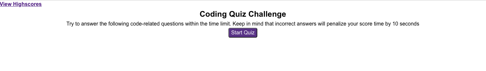
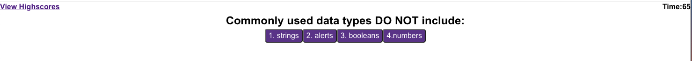
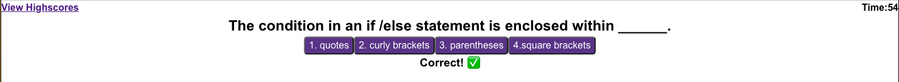
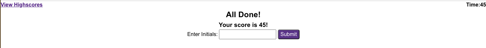

# Code-Quiz

## Description

Boot camp students are learning content quickly in classes each week. They need resources than can quickly test their knowledge on fundamentals. That's where this timed quiz comes in!

The quiz features:

⏱️ A timer that begins at 75 seconds when the start button is clicked.

❓ 5 questions that display about JavaScript syntax consecutively.

✅ A display that shows if the question was answered correctly. If the user answers the question wrong, time is subtracted from the clock.

✍️ The ability for the user to save their score with their initials in their local storage and return to the high scores page whenever they navigate to the quiz.

---

## Access 🔗

To access the timed coding quiz, simply click on the GitHub Pages link in the repo description or follow the link below. [Timed Coding Quiz](lillianedwards.github.io/Code-Quiz)

## Installation

For users new to github, follow the git clone process to copy the code into your local repository.

## Usage

## Credit 

I worked on this project alone, but received help from my TA, Justin Moore.

## License 

This project is not licensed. 
